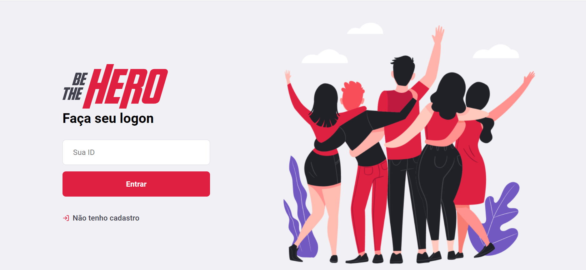
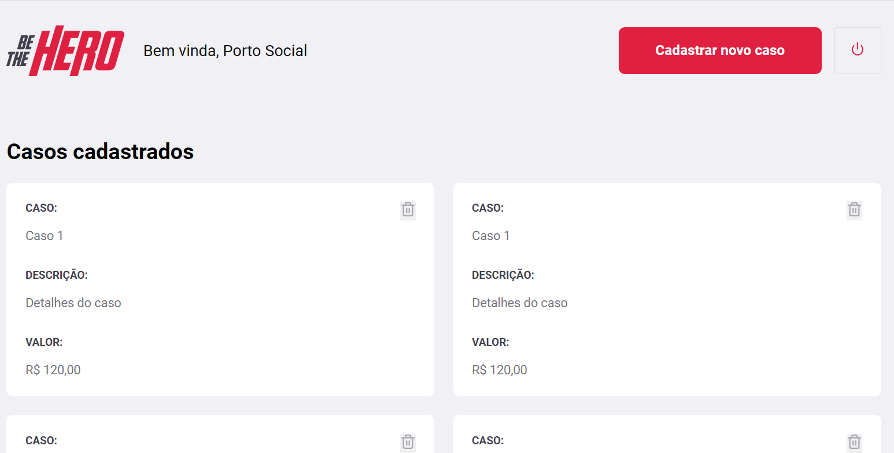

# Be To Hero

Application created in the rocketseat omnistack week

To execute this project, it is necessary to have the node package.

## Start backend application

- `npm start`

This command responsible to create a server in port 3333.

## Star fronend application

- `npm start`

## Built With

- [Node](https://nodejs.org/en/) - Build the backend microservice
- [knex](http://knexjs.org/) - ORM framework
- [React](https://reactjs.org/) - Visual interface framework
- [Insominia](https://insomnia.rest/) - Test HTTP requests

